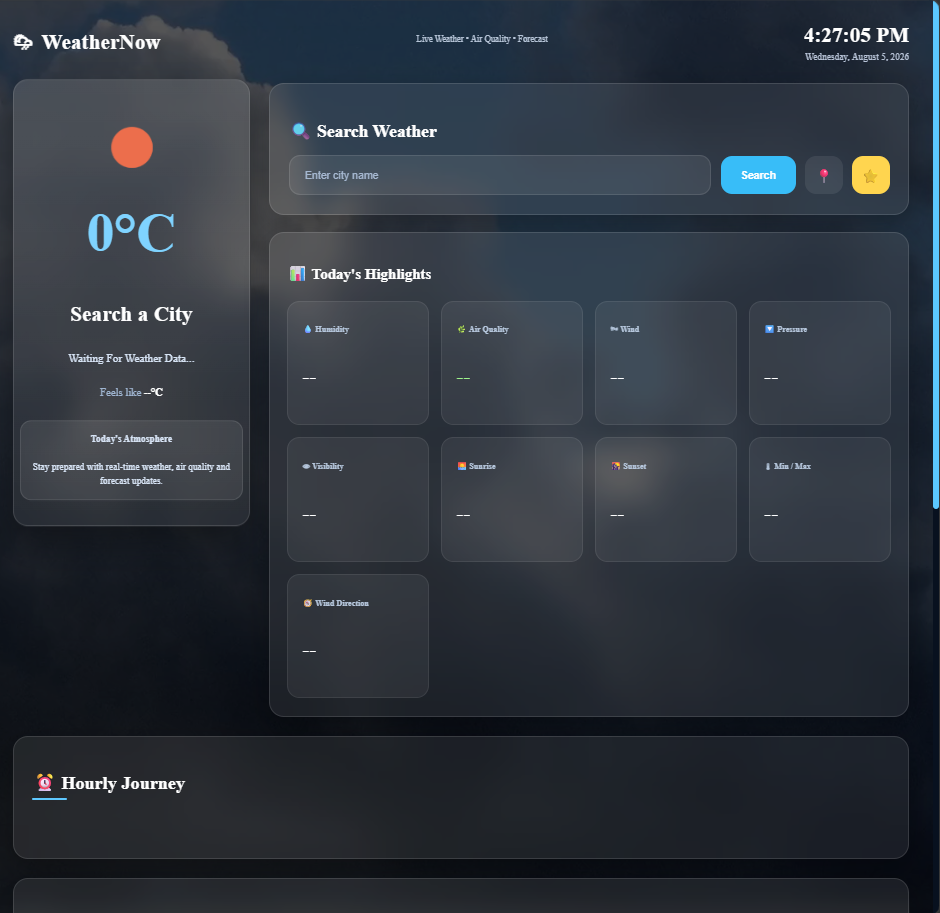
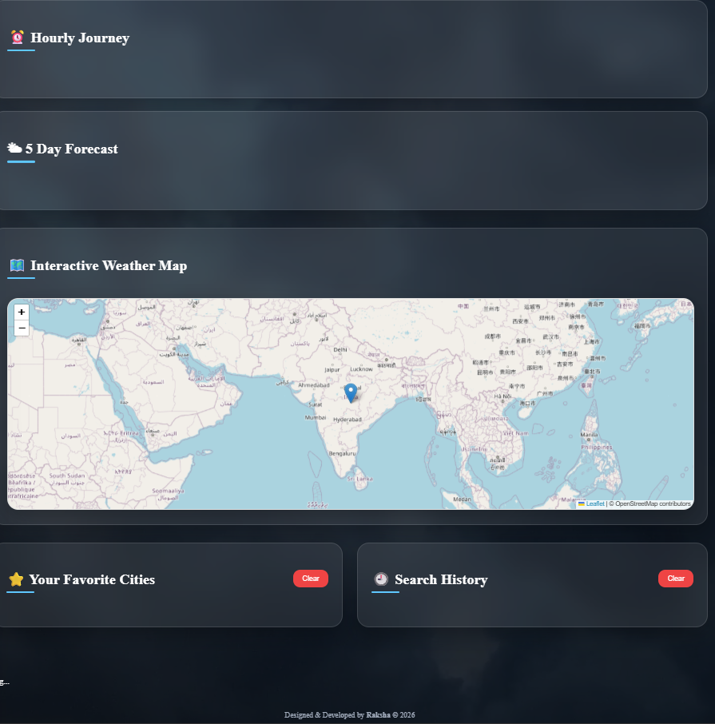
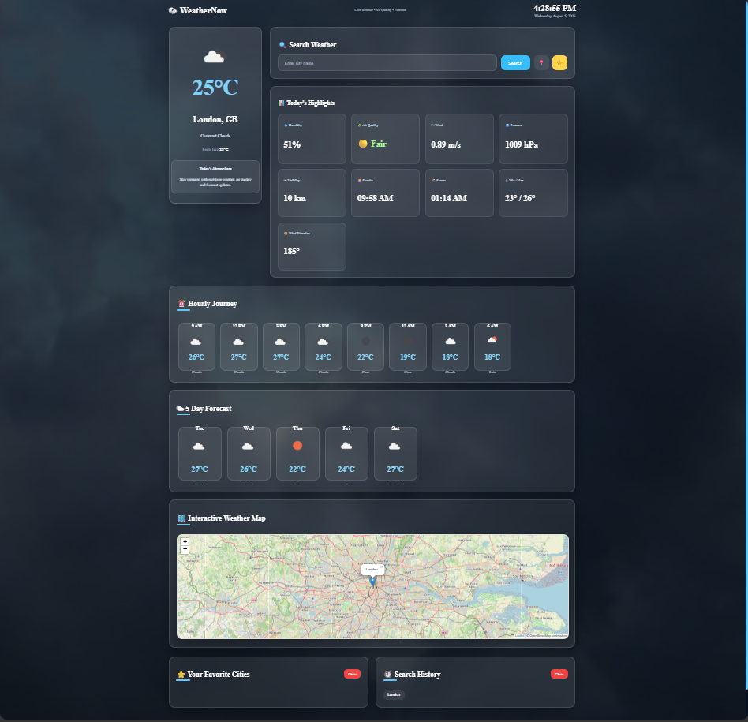
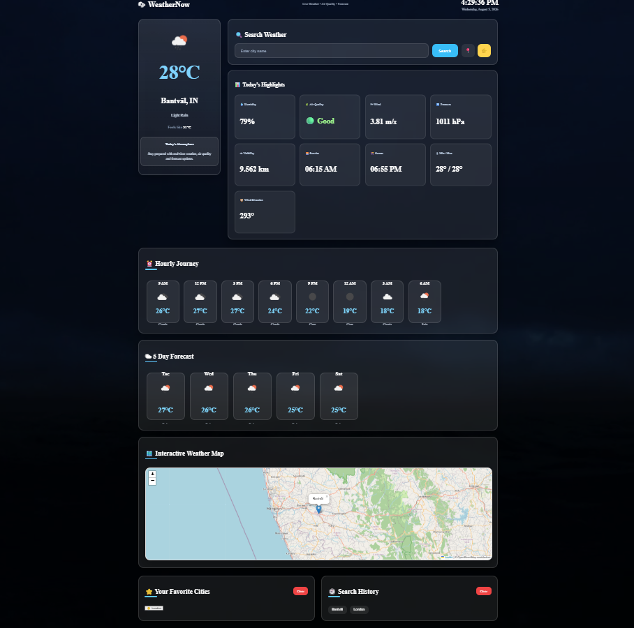
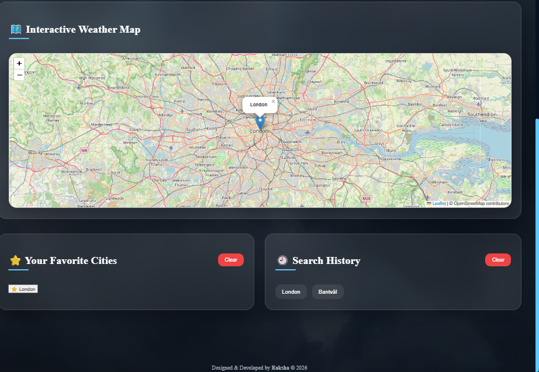

# 🌦️ WeatherNow

A modern and responsive Weather Dashboard built using **HTML, CSS, and JavaScript**. WeatherNow provides real-time weather information, hourly forecasts, 5-day forecasts, air quality, weather maps, favorite cities, and search history using the OpenWeather API.

---

## 📸 Preview

> Screenshots
### Home Dashboard



### Forecast


### My Location

### Weather Map

 

Example:

- Home Dashboard
- Hourly Forecast
- Weather Map
- Mobile View

---

## ✨ Features

- 🌍 Search weather for any city
- 📍 Get weather using current location
- 🌡️ Real-time temperature and weather details
- 💨 Wind speed
- 💧 Humidity
- 🌅 Sunrise & Sunset
- 👁️ Visibility
- 📊 Air Quality Index (AQI)
- 🕒 Hourly Weather Forecast
- 📅 5-Day Weather Forecast
- 🗺️ Interactive Weather Map (Leaflet)
- ⭐ Save Favorite Cities
- 🕘 Recent Search History
- 🎥 Dynamic Weather Background Videos
- 🕒 Live Date & Time
- 📱 Fully Responsive Design
- ✨ Modern Glassmorphism UI

---

## 🛠️ Technologies Used

- HTML5
- CSS3
- JavaScript (ES6)
- OpenWeather API
- Leaflet.js
- Google Fonts (Inter)

---

## 📂 Project Structure

```
WeatherNow/
│
├── assets/
├── videos/
│
├── index.html
├── dashboard.css
│
├── script.js
├── hourly.js
├── favorites.js
├── map.js
│
└── README.md
```

---

## 🚀 Installation

1. Clone the repository

```bash
git clone https://github.com/Raksha-Shetty18/weather-app.git
```

2. Open the project folder.

3. Open `index.html` using Live Server or any local web server.

---

## 🔑 API

This project uses the **OpenWeather API**.

Get your free API key:

https://openweathermap.org/api

Replace the API key in:

```javascript
const apiKey = "2d40d178ba1e3d155dc172d70b2a65fc";
```

---

## 📸 Main Dashboard Includes

- Weather Hero Card
- Search Bar
- Weather Highlights
- Hourly Forecast
- 5-Day Forecast
- Weather Map
- Favorite Cities
- Recent Searches

---

## 📱 Responsive Design

WeatherNow is optimized for:

- Desktop
- Laptop
- Tablet
- Mobile

---

## 🌟 Future Improvements

- AI Weather Assistant
- Weather Alerts
- Multi-language Support
- Dark / Light Theme
- Voice Search
- Weather Charts
- Progressive Web App (PWA)

---

## 👨‍💻 Author

**Raksha**

Information Science & Engineering Student

---

## 📄 License

This project is developed for educational and portfolio purposes.
